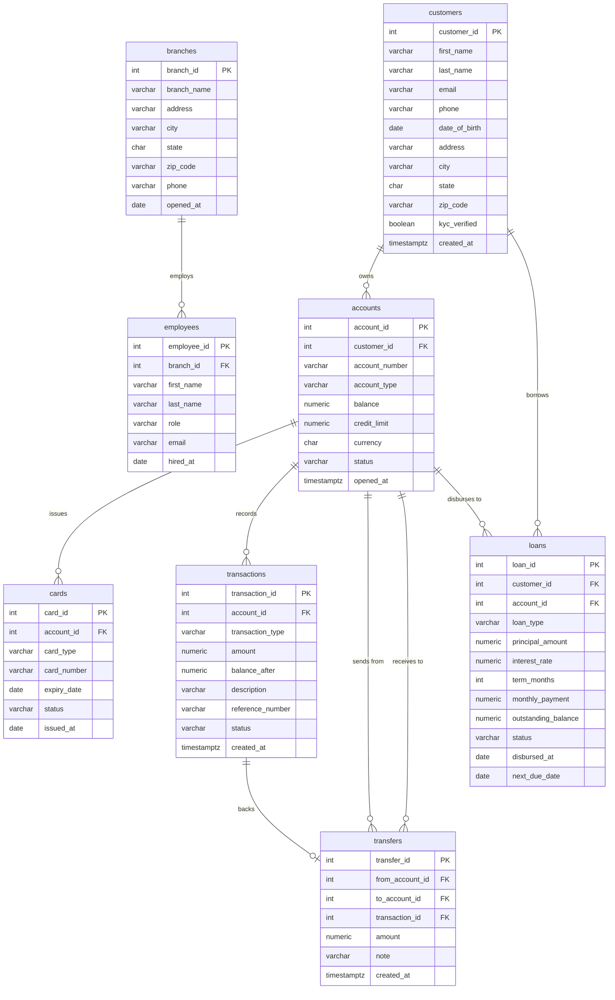

# Bank Database Schema

## Entity Relationship Diagram

## Table Summary

| Table | Rows (seed) | Description |
|---|---|---|
| `branches` | 5 | Bank branch locations |
| `employees` | 10 | Staff assigned to branches |
| `customers` | 20 | Individual bank customers |
| `accounts` | 30 | Checking, Savings, Credit, Business accounts |
| `cards` | 16 | Debit and credit cards per account |
| `transactions` | 68 | Every financial event on an account |
| `transfers` | 4 | Internal transfers linking two accounts |
| `loans` | 8 | Mortgage, personal, auto, and business loans |

## Key Relationships

- A **branch** employs many **employees**
- A **customer** owns one or more **accounts**
- An **account** can have many **cards**, **transactions**, and **loans**
- A **transfer** links two accounts (`from` → `to`) and is backed by a **transaction** record
- A **loan** is tied to both a **customer** (borrower) and an **account** (disbursement target)
